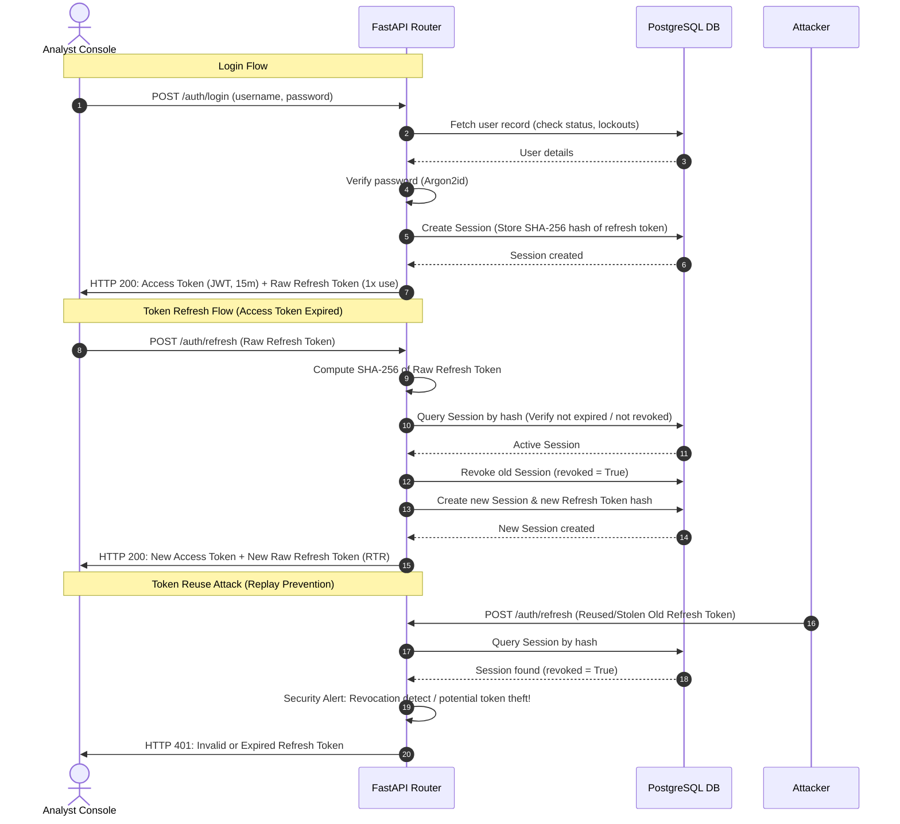

# Module: Authentication and RBAC (M1, M2)

This module handles identity, authentication, session management, and fine-grained Role-Based Access Control (RBAC) for the Zero Trust EDR Manager.

## Features

- **Argon2id Password Hashing**: Enforces a strict password strength policy (minimum 12 characters, requiring uppercase, lowercase, numbers, and symbols).
- **Asymmetric JWT Signing**: Employs `RS256` asymmetric keys. Ephemeral keys are automatically generated at startup if not explicitly configured on disk.
- **Refresh Token Rotation (RTR)**: Long-lived refresh tokens (default 7 days) are rotated on *every use*, preventing replay attacks. Used tokens are revoked.
- **TOTP Multi-Factor Authentication**: Implements pyotp-based TOTP MFA flow (Initiation via QR Code URI, confirmation code validation, and enforce verification on login).
- **Brute Force Lockouts**: Accounts are temporarily locked out for 15 minutes after 5 consecutive failed login attempts.
- **Rate Limiting**: Custom sliding-window rate limiting on login attempts per IP address (10 requests/minute limit).
- **Granular RBAC**: Gate API endpoints behind specific permission dependencies (`roles:read`, `users:write`, etc.) embedded directly in JWT claims with optional database revocation re-checks.

---

## Token Lifecycle & Refresh Token Rotation

Below is a Mermaid sequence diagram representing the login authentication and Refresh Token Rotation (RTR) lifecycle.

---

## Configuration Settings

Key configuration variables in `manager/config.py`:
- `DATABASE_URL`: Connection string to PostgreSQL.
- `JWT_SECRET_KEY_PATH`: File path to RSA private key (PEM).
- `JWT_PUBLIC_KEY_PATH`: File path to RSA public key (PEM).
- `JWT_ALGORITHM`: Signature algorithm (defaults to `RS256`).
- `ACCESS_TOKEN_EXPIRE_MINUTES`: Expiry duration for access tokens (default 15m).
- `REFRESH_TOKEN_EXPIRE_DAYS`: Expiry duration for refresh tokens (default 7d).
- `FORCE_DB_CHECK`: Set to `True` to force database checks on permission gating checks rather than trusting claims embedded in the JWT.
- `LOGIN_RATE_LIMIT`: IP login limits (default `10/minute`).
